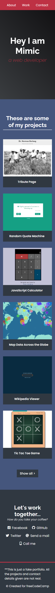
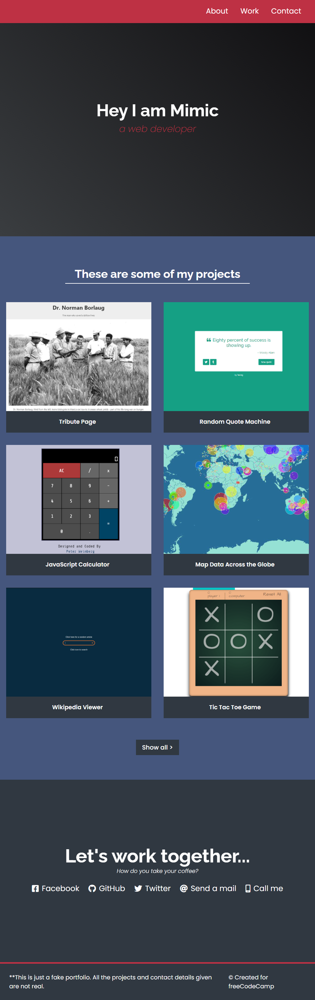
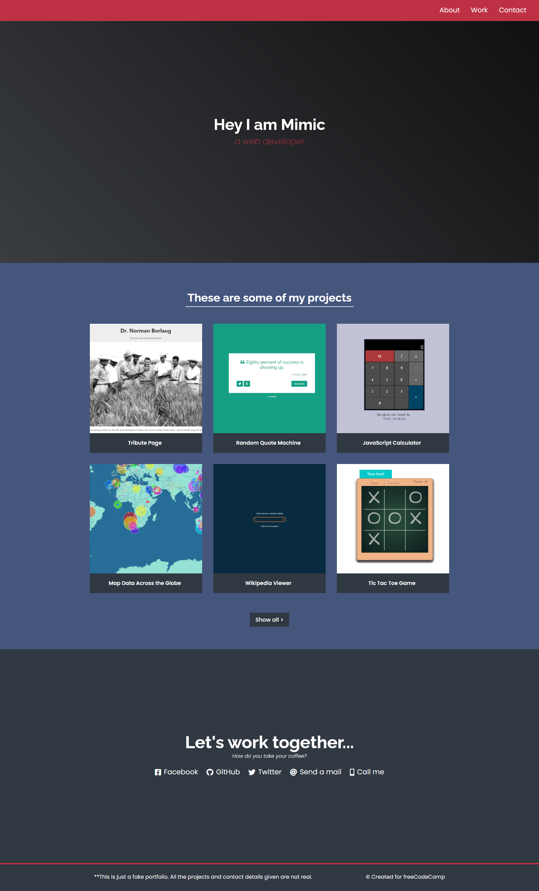

# Kolehiyolo | freeCodeCamp | Build a Personal Portfolio Webpage
Welcome! I am a budding coder and this is my submission to the 'Build a Personal Portfolio Webpage' project from freeCodeCamp.

## Table of contents
- [Overview](#overview)
  - [Summary](#summary)
  - [The Challenge](#the-challenge)
  - [Screenshots](#screenshots)
  - [Links](#links)
- [My Process](#my-process)
  - [Built With](#built-with)
  - [What I Learned](#what-i-learned)
  - [Continued Development](#continued-development)
  - [Useful Resources](#useful-resources)
- [Author](#author)
- [Acknowledgments](#acknowledgments)

## Overview
### Summary
This project is so simply beautiful and straightforward and serves as a great inspiration for my own personal portfolio. However, I can't exactly think of anything ground-breaking with this project on the technical-side, but the design is just so stellar and serves as a great template for major projects.

### The Challenge
- Perfectly mimic the sample page from [CodePen](https://codepen.io/freeCodeCamp/full/zNBOYG)
- Make sure to follow the user stories dictated by freeCodeCamp
- Build it while ensuring accessibility and responsive-ness

### Screenshots

  
  
  

### Links
(TODO - Update the Links)
- freeCodeCamp Challenge: [freeCodeCamp | Build a Personal Portfolio Webpage](https://www.freecodecamp.org/learn/responsive-web-design/responsive-web-design-projects/build-a-personal-portfolio-webpage)
- Sample: [CodePen](https://codepen.io/freeCodeCamp/full/zNBOYG)
- Solution URL: [GitHub Repo](https://github.com/kolehiyolo/freecodecamp--build_a_personal_portfolio_webpage)
- Live Site URL (Static): [Kolehiyolo | freeCodeCamp | Build a Personal Portfolio Webpage (Static)]()
- Live Site URL: [Kolehiyolo | freeCodeCamp | Build a Personal Portfolio Webpage]()

## My process
### Built with
- HTML5
- CSS5
- SASS
- Mobile-first workflow

### What I learned
The most notable of the things I've come to familiarize myself with while working on this project is the fixed-position header, bouncing elements on hover, more proper centering of elements, responsive grid, and element fade-in on parent hover.

The hover effects in particular were a challenge. I remember doing extensive trial-and-errors while consulting the CSS Selectors Reference Docs by w3 Schools until I finally got the Project Title hover effects to work. I am referring to the effect where the orange angle tags fade-in as you hover over a project card.

### Continued development
What I've gotten out of this exercise is to really not shy away with technical documentation and being patient while also effective with trial-and-errors. I've come to appreciate more abstract CSS selectors and I even made sure to have the articles/documentation bookmarked at all times.

Beyond anything else, though, I've come to realize that even such surprisingly simple-looking projects can be so beautiful. The project just looks so clean and formal yet still very engaging and this is certainly a standard that I hope to always go back to when building my projects.

### Useful resources
- [w3 Schools | CSS Selectors Reference](https://www.w3schools.com/cssref/css_selectors.asp) - This incredible documentation on CSS selectors is a god-send. I would come back to this regularly when dealing with animation-related tasks since those usually involve some abstract CSS targeting like sibling/parent hovers

## Author
- Website - [Add your name here](https://www.your-site.com)
- Frontend Mentor - [@kolehiyolo | Frontend Mentor](https://www.frontendmentor.io/profile/kolehiyolo)
- LinkedIn - [@Tristan Sean Paul Cinco | LinkedIn](https://www.linkedin.com/in/tristan-sean-paul-cinco-8685061a1/)
- GitHub - [@kolehiyolo | Github](https://github.com/kolehiyolo)
- YouTube - [@Tristan Sean Paul Cinco | YouTube](https://www.youtube.com/channel/UCeQfdvq83XLp-eS4vbZZN8Q)
- Facebook - [@Tristan Sean Paul Cinco | Facebook](https://www.facebook.com/tristanseanpaul.cinco.39/)
- Twitter - [@kolehiyolo1221 | Twitter](https://twitter.com/kolehiyolo1221)
- Instagram - [@kolehiyolo | Instagram](https://www.twitter.com/yourusername)

## Acknowledgments
As this is the final project for the Responsive Web Design certification, I would just like to express my undying gratitude to freeCodeCamp because c'mon. This whole thing is just great and the exercises within the site itself are amazing. They can be taxing, though, as they can be too text-y, but they still managed to smoothen my HTML and CSS knowledge edges. Thank you, freeCodeCamp!